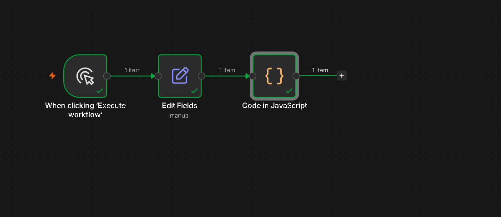

# n8n 跨境电商 AI 文案自动化工作流

使用 **n8n + Coze API** 搭建的跨境电商产品英文文案自动生成工作流。

## 工作流架构

```
[手动触发] → [Set 产品数据] → [Code 调用 AI] → [输出结果]
```

1. **Manual Trigger** — 手动触发或定时调度
2. **Set Node** — 模拟从飞书表格 / Excel 读取产品数据（产品名、SKU、卖点、售价、目标平台）
3. **Code Node (JavaScript)** — 动态构建 HTTP 请求，调用 Coze API（流式 SSE），解析返回的英文文案
4. **Output** — 输出结构化结果（SKU + 英文文案 + 生成时间）

## 核心代码

`workflow-code.js` — n8n Code 节点中的完整 JavaScript 代码，包含：

- 产品数据读取与动态 Prompt 构建
- Coze API v3 流式对话调用（SSE）
- 流式响应解析（逐行解析 `data:` 事件）
- 文案内容提取与去重
- 格式化结构化输出

## 技术栈

- **n8n** — 开源自动化工作流平台
- **Coze API v3** — AI 大模型对话接口（SSE 流式）
- **Docker** — n8n 容器化部署

## 运行方式

```bash
# 启动 n8n（Docker）
docker run -d --name n8n -p 5678:5678 n8nio/n8n

# 浏览器打开 http://localhost:5678
# 导入 workflow-export.json 或手动创建工作流
# 将 workflow-code.js 内容粘贴到 Code 节点中
```

## 工作流截图

### 节点流程图


### AI 生成结果


## 输出示例

```json
{
  "sku": "BT-2026-PRO",
  "productName": "蓝牙降噪耳机",
  "copy": "### TITLE\nBluetooth Noise Canceling Headphones BT-2026-PRO - 30H Playtime...\n\n### BULLETS\n1. ADVANCED ACTIVE NOISE CANCELLATION...\n\n### DESCRIPTION\nElevate your audio experience...",
  "generatedAt": "2026-07-24T08:53:24.000Z"
}
```

## 应用场景

- 跨境电商产品上架自动化
- 多平台（Amazon/Temu/TikTok Shop）产品文案批量生成
- 飞书表格 + n8n + AI 的自动化闭环
- 影刀 RPA 替代方案中的 AI 节点
